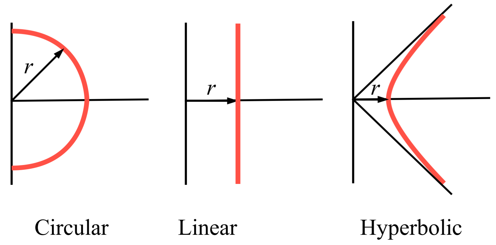
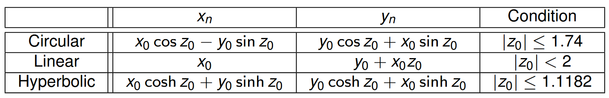

# CORDIC
This crate has a duel purpose help me fully understand CORDIC for ECE 496B and borden my understanding of Rust.

## Arithmetic Overview 

CORDIC generates many elemental functions necessary in computer arithmetic. There are three CORDICs: Linear, Circular, and Hyperbolic, all of which generate a different set of elementary functions. Each of the cordic follow the same process for generation but have different conditions. 

The CORDIC was developed to be able generate multiple elementary function after just one calculation. This system is highly used by calculators and lower level systems with sub 32bit OS. 

CORDIC is made up of 5 parameters:
- x(i) 
- y(i)
- $\delta(i)$
- $\theta(i)$
- $\mu(i)$

Each parameter is synthesis slightly different for each type of cordic. 

### Linear CORDIC
`Elementary functions:` [$\frac{a}{b}$ $a\times b$]

### Circular CORDIC 
`Elementary functions:` [$\sin()$ $\cos()$]

Circular cordic is defined through the ___ of polar coordinates.

### Hyperbolic CORDIC
`Elementary functions:` [$\sinh() \cosh()$]

